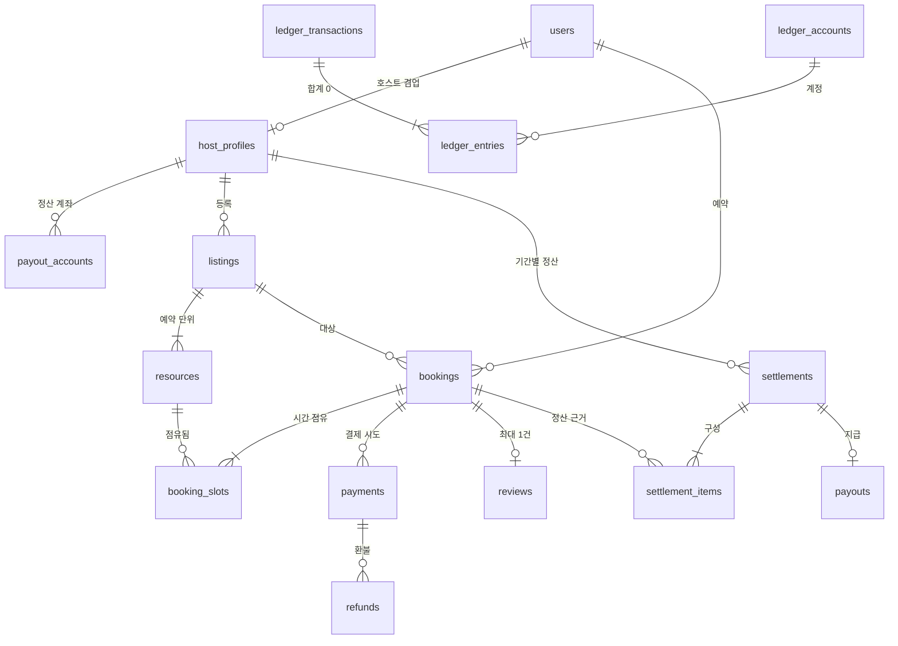
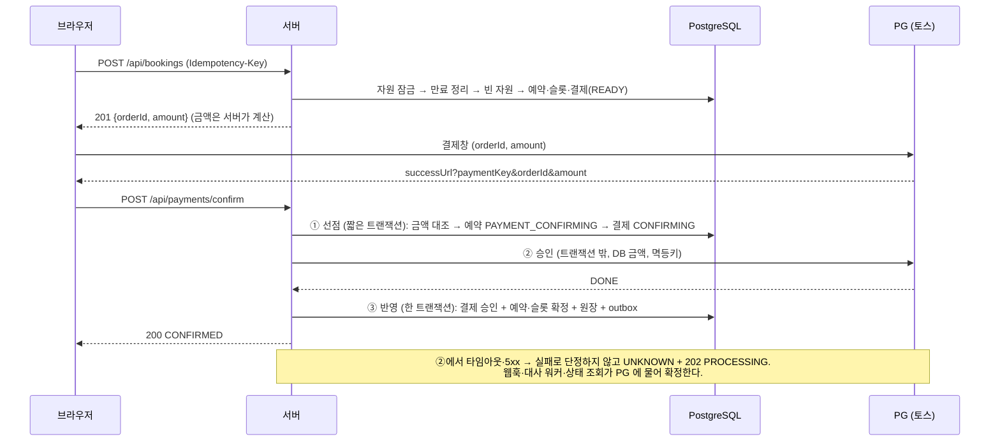

# 설계 노트

구현에 앞서 정한 설계와, 그 판단의 근거입니다. 코드는 이 문서의 결정을 따르고, 결정이 바뀐 곳은 아래에 "구현하며 바뀐 것"으로 따로 적었습니다.

## 1. 무엇을 직접 만들고, 무엇을 가져다 쓰는가

판단 기준 네 가지: **규제**(직접 하면 등록·인증이 필요한가) · **실패 비용**(틀리면 누가 얼마나 손해인가) · **차별화**(경쟁력의 원천인가) · **데이터 소유**(남의 시스템에만 있으면 운영이 막히는가).

| 구성 요소 | 결정 | 근거 |
|---|---|---|
| 카드·간편결제의 인증·승인·취소 | **Buy** (토스페이먼츠) | 카드번호가 우리 서버를 거치지 않는다 → PCI 범위 밖 |
| 결제 **검증**(금액·주문 대조), 결제 상태 머신, 멱등 처리 | **Build** | PG 는 요청받은 금액을 승인할 뿐, 그 금액이 맞는지는 모른다 |
| 사내 원장, 수수료·정산 계산 | **Build** | 수수료율·환불 규정·정산 주기는 회사 정책 그 자체이고 분쟁 때 근거가 된다 |
| 호스트에게 실제 송금 | **Buy** (PG 지급대행·펌뱅킹) | 남의 돈을 보관·이체하는 일은 규제 영역 |
| 대사(PG 기록 ↔ 내 원장) | **Build** | 이 대조가 없으면 원장은 "그랬으면 좋겠다"는 기록일 뿐이다 |
| 예약 엔진(가용 시간·홀드·겹침 방지) | **Build** | 시간·정리 버퍼·장비 수량·결제 연동이 얽혀 범용 예약 SaaS 로는 정산과 묶을 수 없다 |
| 후기·평점 | **Build** | 단순하고, "실제 이용한 사람만"이라는 규칙이 예약 데이터에 묶여 있다 |
| 본인인증·계좌 실명확인·알림톡·로그인·지도·이미지 저장 | Buy | 범용이고 규제·인증이 필요하다 |

PG 는 `PaymentGateway` 인터페이스(`confirm` / `getByOrderId` / `cancel`) 뒤에 둔다. 토스 어댑터와 가짜 PG 가 같은 인터페이스를 구현하므로, 포트원 등으로 바꿀 때 바뀌는 곳은 어댑터 하나다.

## 2. ERD



핵심 결정 (전체 DDL: [`db/migrations/001_init.sql`](../db/migrations/001_init.sql))

1. **사용자는 한 테이블, 공급자 정보는 `host_profiles` 로 분리** — 한 사람이 빌리기도 하고 빌려주기도 한다.
2. **상품(listing)과 자원(resource)을 분리** — 겹침을 막는 단위는 물리적 자원이다. 스튜디오 1개 = 1행, 같은 조명 5대 = 5행.
3. **예약(bookings)과 슬롯(booking_slots)을 분리** — `period` 는 고객이 산 시간, `blocked` 는 자원이 실제로 막히는 시간(= period + 정리 버퍼).
4. **가격·수수료율·취소 정책은 예약 시점의 스냅샷을 저장** — 호스트가 나중에 가격이나 수수료율을 바꿔도 정산 근거가 흔들리지 않는다.
5. **금액은 원 단위 `bigint`**, 시간 구간은 `tstzrange` 의 반열린 구간 `[)`.
6. **상태 전이는 조건부 UPDATE 로 하고, 허용되지 않는 전이는 DB 트리거가 거부한다.**

```
PENDING_PAYMENT ─(승인 선점)→ PAYMENT_CONFIRMING ─(PG 성공)→ CONFIRMED ─(이용 종료)→ COMPLETED
      │  ▲                         │  │
      │  └──(카드 거절·미승인 확정)──┘  └─(위변조 의심)→ PAYMENT_FAILED
      │(홀드 만료)                   │(홀드가 지난 뒤 실패 확정)
      ▼                             ▼
   EXPIRED ◄────────────────────────┘
```

### 원장 (복식부기) 분개 예시 — 10만 원, 플랫폼 수수료 10%

| 사건 | 차변(+) | 대변(−) |
|---|---|---|
| 결제 승인 | PG 미수금 100,000 | 고객 예수금 100,000 |
| 이용 완료 | 고객 예수금 100,000 | 호스트 미지급금 90,000, 수수료 매출 10,000 |
| 이용 전 전액 환불 | 고객 예수금 100,000 | PG 미수금 100,000 |

거래별 합계 0 은 DB 의 지연 제약 트리거가 COMMIT 시점에 검사하고, 원장 줄은 UPDATE·DELETE 가 막혀 있다(틀렸으면 반대 분개로 정정).

## 3. 중복 예약(Overbooking) 방어

### 실험으로 확인한 것
PostgreSQL 16 에서 커넥션 50개가 한 스튜디오의 09–11, 10–12, 11–13시를 동시에 요청하는 라운드를 반복했다.

| 방식 | 겹치는 활성 슬롯 쌍 | 데드락 |
|---|---|---|
| A. 조회한 뒤 INSERT (흔한 구현) | **수천 쌍** — 모든 라운드에서 이중 예약, 50건이 전부 성공한 라운드도 있음 | — |
| B. EXCLUDE 제약만 | 0 | 500건 중 91건 (실험 전체 89.9초) |
| C. **EXCLUDE + 자원 행 잠금** | **0** | **0** (실험 전체 1.2초) |

- A 가 뚫리는 이유: 동시에 "겹침 없음"을 확인한 뒤 모두 INSERT 한다(확인과 쓰기 사이의 틈, TOCTOU). 기존 행에 `FOR UPDATE` 를 걸어도 **아직 없는 행**은 잠글 수 없다.
- B 는 정확하지만 EXCLUDE 가 "인덱스에 먼저 넣고 나서 충돌 검사"를 하므로, 두 트랜잭션이 서로의 미커밋 행을 기다리다 데드락이 난다.
- 그래서 C: 자원 행 잠금으로 같은 자원의 요청을 줄 세우고, EXCLUDE 제약은 어떤 코드 경로로도 우회할 수 없는 최종 판정으로 둔다.

이 실험은 `tests/meta-invariants.test.ts` 에 테스트로 남아 있다 — ① 조회 후 INSERT + 제약 없음 → 이중 예약 발생, ② 같은 구현 + 제약 → 겹침 0, ③ 실제 구현은 제약을 빼도 겹침 0 (잠금 + 빈 자원 선택이 독립된 두 번째 방어선).

### 다층 방어 (`src/server/bookings/create.ts`)
1. **멱등키** `(consumer_id, idempotency_key)` UNIQUE — 재전송·더블클릭은 같은 예약을 돌려주고, 같은 키에 다른 내용이면 422.
2. **자원 행 잠금** `FOR NO KEY UPDATE` (id 순) — 같은 상품에 대한 예약 트랜잭션이 줄을 선다.
3. **빈 자원 선택** — 잠금을 쥔 상태에서 겹치지 않는 자원을 고른다. 없으면 `SLOT_TAKEN`.
4. **EXCLUDE 제약** `no_overbooking` — 위가 틀려도 DB 가 겹침을 거부한다 (23P01 → `SLOT_TAKEN`).
5. **짧은 트랜잭션** — PG 호출은 절대 트랜잭션 안에서 하지 않고, `lock_timeout` 을 걸어 오래 기다리지 않는다.
6. **홀드 만료는 `bookings.status = PENDING_PAYMENT` 일 때만** — 결제 확정 중인 슬롯은 홀드가 지나도 풀지 않는다.

잠금 순서 규칙: **예약 → 결제 → 슬롯**. 만료 작업·결제 확정·웹훅 처리가 모두 이 순서를 지키므로 서로 다른 순서로 잠그다 생기는 데드락이 없다.

## 4. 결제 확정 흐름



## 5. 구현하며 바뀐 것

- 슬롯에 `hold_expires_at` 을 두고 그것으로 만료를 판정하려 했으나, 실험 중 **결제 확정 중(PG 호출 중)인 슬롯까지 다른 사람에게 풀리는** 구멍을 찾았다 → 만료 권한을 `bookings.status` 하나로 모았다.
- 결제 상태에 "승인됐지만 예약에 쓸 수 없는 결제"를 위한 `refund_pending` 을 추가했다. 환불 의사를 DB 에 먼저 남기고(내구성) PG 호출은 커밋 뒤에 하므로, 도중에 죽어도 대사 워커가 같은 멱등키로 이어서 환불한다.
- 예약 상태 `PENDING_PAYMENT → PAYMENT_FAILED`(위변조 의심) 전이를 허용했다.
