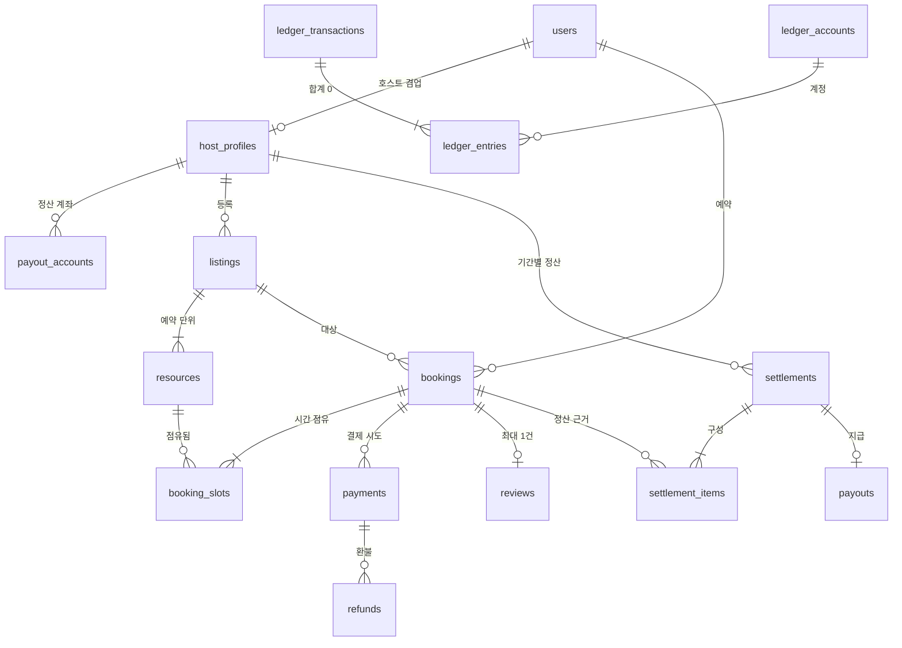
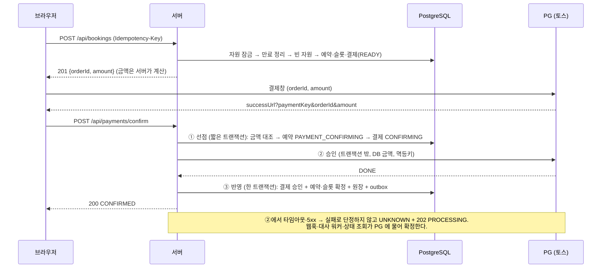

# 설계 노트

구현에 앞서 정한 설계와, 그 판단의 근거입니다. 코드는 이 문서의 결정을 따르고, 결정이 바뀐 곳은 아래에 "구현하며 바뀐 것"으로 따로 적었습니다.

## 1. 무엇을 직접 만들고, 무엇을 가져다 쓰는가

판단 기준 네 가지: **규제**(직접 하면 등록·인증이 필요한가) · **실패 비용**(틀리면 누가 얼마나 손해인가) · **차별화**(경쟁력의 원천인가) · **데이터 소유**(남의 시스템에만 있으면 운영이 막히는가).

| 구성 요소 | 결정 | 근거 |
|---|---|---|
| 카드·간편결제의 인증·승인·취소 | **Buy** (토스페이먼츠) | 카드번호가 우리 서버를 거치지 않는다 → PCI 범위 밖 |
| 결제 **검증**(금액·주문 대조), 결제 상태 머신, 멱등 처리 | **Build** | PG 는 요청받은 금액을 승인할 뿐, 그 금액이 맞는지는 모른다 |
| 사내 원장, 수수료·정산 계산 | **Build** | 수수료율·환불 규정·정산 주기는 회사 정책 그 자체이고 분쟁 때 근거가 된다 |
| 호스트에게 실제 송금 | **Buy** (PG 지급대행·펌뱅킹) | 남의 돈을 보관·이체하는 일은 규제 영역 |
| 대사(PG 기록 ↔ 내 원장) | **Build** | 이 대조가 없으면 원장은 "그랬으면 좋겠다"는 기록일 뿐이다 |
| 예약 엔진(가용 시간·홀드·겹침 방지) | **Build** | 시간·정리 버퍼·장비 수량·결제 연동이 얽혀 범용 예약 SaaS 로는 정산과 묶을 수 없다 |
| 후기·평점 | **Build** | 단순하고, "실제 이용한 사람만"이라는 규칙이 예약 데이터에 묶여 있다 |
| 본인인증·계좌 실명확인·알림톡·로그인·지도·이미지 저장 | Buy | 범용이고 규제·인증이 필요하다 |

PG 는 `PaymentGateway` 인터페이스(`confirm` / `getByOrderId` / `cancel`) 뒤에 둔다. 토스·포트원 어댑터와 가짜 PG 가 같은 인터페이스를 구현한다. 다만 포트원을 붙여 보니 어댑터 하나로 끝나지 않았다 (아래 "포트원을 붙여 보고 알게 된 것").

### 왜 토스페이먼츠인가 — 그리고 정직하게 말하면

**토스를 고른 것은 PG 들을 비교한 결과가 아닙니다.** 국내 개발자에게 가장 익숙한 선택지였고, 이 프로젝트에 필요한 구조가 문서에 갖춰져 있어서 출발점으로 삼았습니다.
수수료율·정산 조건은 비교해 보지 않았고, 비교할 수도 없습니다(견적과 계약이 필요한 값이라서).

이 설계가 PG 에게 요구하는 것은 세 가지입니다.

| 필요한 것 | 왜 필요한가 | 토스 API |
|---|---|---|
| 서버가 **금액을 직접 지정해** 승인하는 호출 | 브라우저가 보낸 금액을 믿지 않고 DB 금액으로 승인한다 | `POST /v1/payments/confirm` |
| 승인 호출의 **멱등키** | 타임아웃 뒤 재시도·대사가 이중 승인이 되지 않는다 | `Idempotency-Key` 헤더 |
| **주문번호로 결제를 조회**하는 호출 | 웹훅 본문을 믿지 않고 다시 물어본다 / "알 수 없음"을 대사로 결론낸다 | `GET /v1/payments/orders/{orderId}` |

다른 PG 도 이름만 다르게 이런 기능을 제공할 것이라고 짐작했는데, 포트원 어댑터를 만들며 확인해 보니 **첫 번째가 기본 흐름에는 없었습니다** (아래).

**틀렸을 때의 비용을 작게 만들어 두었습니다.** 결제 검증·상태 머신·원장·대사는 PG 를 모르고 `PaymentGateway` 인터페이스만 압니다. PG 를 바꾸면 고칠 곳은 다음입니다.

- 어댑터 (`toss.ts` ↔ 새 PG 의 요청 형식, 그리고 "확정된 실패 / 알 수 없음" 분류표)
- 웹훅 수신부의 인증·이벤트 형식 (본문을 믿지 않고 주문번호로 재조회하는 구조는 그대로)
- 프론트의 결제창 호출부 (`src/lib/checkout.ts`)

반대로 PG 를 바꿔도 **바뀌지 않는 것**이 이 프로젝트의 핵심입니다: 금액 대조, 중복 예약 방어, 결제 상태 전이, 원장.

### 포트원을 붙여 보고 알게 된 것

포트원 V2 어댑터(`src/server/payments/portone.ts`, 자세한 내용은 [`docs/portone.md`](portone.md))를 만들면서 위 목록이 틀렸다는 것을 알았습니다.
포트원의 기본 흐름은 **결제창 안에서 결제가 완료**되고, 서버는 그 뒤에 조회로 검증합니다. 토스처럼 "서버가 금액을 지정해 승인"하는 단계가 없으므로,
금액이 다르면 "승인하지 않는다"가 아니라 "확정하지 않고 **자동 환불**한다"로 방어선이 바뀝니다. 그리고 공통 코드 세 곳이 토스의 성질에 기대고 있었습니다.

| 토스에 기대던 가정 | 포트원에서 생기는 일 | 바꾼 것 |
|---|---|---|
| 홀드가 지난 결제 대기 예약은 돈이 안 움직였다 | 결제 직후 브라우저 종료 + 웹훅 유실 → 돈은 빠졌는데 예약은 만료 | PG 의 `capturesBeforeServerConfirm` 이 참이면 슬롯을 쥔 채 확인 단계로 넘기고, 대사가 확정하거나 푼다 |
| PG 가 "결제 전(READY)"이라고 답할 일은 없다 | 성공 페이지만 위조 호출 → 예약이 "확인 중"으로 슬롯을 영원히 점유 | 조회 지연 유예 뒤 실패로 정리 (토스에도 적용) |
| 취소는 결제키로 한다 | 포트원은 `paymentId`(= 주문번호)로 취소 | `CancelRequest` 에 주문번호 추가 |

**교훈** — 인터페이스로 감싸도 PG 의 **돈이 움직이는 시점**은 감싸지지 않습니다. "어댑터만 바꾸면 된다"는 말은 두 번째 구현을 만들어 본 뒤에야 검증됩니다.

**이 선택을 다시 열어야 하는 지점 — 호스트 정산.** 이 프로젝트는 호스트에게 실제로 송금하는 일을 Buy 로 분류하고 구현하지 않았습니다(내부 원장에 정산 대상 금액까지만 쌓습니다).
중개 플랫폼에서는 이 부분이 PG 선택에 가장 큰 영향을 줄 수 있습니다. PG 마다 지급대행·분할정산 상품의 유무와 조건이 다르고, 여러 PG 를 하나의 연동으로 묶어 주는 서비스(포트원 등)도 있습니다.
어느 쪽이 맞는지는 코드가 아니라 **계약 조건과 운영 방식**으로 정해지므로, 아는 척하지 않고 확인할 항목으로 남겨 둡니다.

실제로 정한다면 이 순서로 확인합니다.

1. **회사가 이미 쓰는 PG·계약이 있는가** — 있다면 그것을 따르는 것이 거의 항상 맞습니다. PG 를 바꾸는 비용은 코드보다 계약·정산 프로세스에 있습니다.
2. 호스트 정산(지급대행/분할정산)을 PG 가 제공하는가, 비용과 정산 주기는 어떤가
3. 필요한 결제 수단(간편결제 등)과 수수료율
4. 웹훅 재전송 정책, 샌드박스 품질, 장애 이력

**검증 상태.** 토스·포트원 어댑터 모두 **실제 PG API 에 대해서는 한 번도 실행하지 못했습니다**(개발 환경의 네트워크 정책이 막고 있음). 토스는 공개 문서의 요청 형식, 포트원은 공식 SDK 의 타입 정의와 대조해 작성했고, 로컬 모의 서버와 가짜 PG 로 검증했습니다. 실제 계약을 확인하는 스크립트와 수동 체크리스트를 `docs/toss-sandbox.md`, `docs/portone.md` 에 두었습니다.

## 2. ERD



핵심 결정 (전체 DDL: [`db/migrations/001_init.sql`](../db/migrations/001_init.sql))

1. **사용자는 한 테이블, 공급자 정보는 `host_profiles` 로 분리** — 한 사람이 빌리기도 하고 빌려주기도 한다.
2. **상품(listing)과 자원(resource)을 분리** — 겹침을 막는 단위는 물리적 자원이다. 스튜디오 1개 = 1행, 같은 조명 5대 = 5행.
3. **예약(bookings)과 슬롯(booking_slots)을 분리** — `period` 는 고객이 산 시간, `blocked` 는 자원이 실제로 막히는 시간(= period + 정리 버퍼).
4. **가격·수수료율·취소 정책은 예약 시점의 스냅샷을 저장** — 호스트가 나중에 가격이나 수수료율을 바꿔도 정산 근거가 흔들리지 않는다.
5. **금액은 원 단위 `bigint`**, 시간 구간은 `tstzrange` 의 반열린 구간 `[)`.
6. **상태 전이는 조건부 UPDATE 로 하고, 허용되지 않는 전이는 DB 트리거가 거부한다.**

```
PENDING_PAYMENT ─(승인 선점)→ PAYMENT_CONFIRMING ─(PG 성공)→ CONFIRMED ─(이용 종료)→ COMPLETED
      │  ▲                         │  │
      │  └──(카드 거절·미승인 확정)──┘  └─(위변조 의심)→ PAYMENT_FAILED
      │(홀드 만료)                   │(홀드가 지난 뒤 실패 확정)
      ▼                             ▼
   EXPIRED ◄────────────────────────┘
```

### 원장 (복식부기) 분개 예시 — 10만 원, 플랫폼 수수료 10%

| 사건 | 차변(+) | 대변(−) |
|---|---|---|
| 결제 승인 | PG 미수금 100,000 | 고객 예수금 100,000 |
| 이용 완료 | 고객 예수금 100,000 | 호스트 미지급금 90,000, 수수료 매출 10,000 |
| 이용 전 전액 환불 | 고객 예수금 100,000 | PG 미수금 100,000 |

거래별 합계 0 은 DB 의 지연 제약 트리거가 COMMIT 시점에 검사하고, 원장 줄은 UPDATE·DELETE 가 막혀 있다(틀렸으면 반대 분개로 정정).

**호스트 화면은 원장에서 읽는다.** 호스트에게 보여 주는 정산 내역(`src/server/host/statement.ts`)은 예약 행의 금액을 다시 더하지 않고, `REVENUE_RECOGNIZED` 거래의 호스트 미지급금·수수료 줄을 읽는다.
예약 화면의 숫자와 원장이 어긋나면 그것이 곧 사고이므로, 테스트는 원장에서 읽은 정산액과 예약 시점 스냅샷(`price_snapshot.hostNet`)의 합이 독립적으로 같은지 본다.
호스트가 시간당 가격을 바꿔도(`pricing.ts`) 이미 잡힌 예약은 스냅샷을 쓰므로 손님이 본 가격이 결제·정산까지 그대로 간다. 실제 지급(송금)은 규제 영역이라 구현하지 않았다(1장).

## 3. 중복 예약(Overbooking) 방어

### 실험으로 확인한 것
PostgreSQL 16 에서 커넥션 50개가 한 스튜디오의 09–11, 10–12, 11–13시를 동시에 요청하는 라운드를 반복했다.

| 방식 | 겹치는 활성 슬롯 쌍 | 데드락 |
|---|---|---|
| A. 조회한 뒤 INSERT (흔한 구현) | **수천 쌍** — 모든 라운드에서 이중 예약, 50건이 전부 성공한 라운드도 있음 | — |
| B. EXCLUDE 제약만 | 0 | 500건 중 91건 (실험 전체 89.9초) |
| C. **EXCLUDE + 자원 행 잠금** | **0** | **0** (실험 전체 1.2초) |

- A 가 뚫리는 이유: 동시에 "겹침 없음"을 확인한 뒤 모두 INSERT 한다(확인과 쓰기 사이의 틈, TOCTOU). 기존 행에 `FOR UPDATE` 를 걸어도 **아직 없는 행**은 잠글 수 없다.
- B 는 정확하지만 EXCLUDE 가 "인덱스에 먼저 넣고 나서 충돌 검사"를 하므로, 두 트랜잭션이 서로의 미커밋 행을 기다리다 데드락이 난다.
- 그래서 C: 자원 행 잠금으로 같은 자원의 요청을 줄 세우고, EXCLUDE 제약은 어떤 코드 경로로도 우회할 수 없는 최종 판정으로 둔다.

이 실험은 `tests/meta-invariants.test.ts` 에 테스트로 남아 있다 — ① 조회 후 INSERT + 제약 없음 → 이중 예약 발생, ② 같은 구현 + 제약 → 겹침 0, ③ 실제 구현은 제약을 빼도 겹침 0 (잠금 + 빈 자원 선택이 독립된 두 번째 방어선).

### 다층 방어 (`src/server/bookings/create.ts`)
1. **멱등키** `(consumer_id, idempotency_key)` UNIQUE — 재전송·더블클릭은 같은 예약을 돌려주고, 같은 키에 다른 내용이면 422.
2. **자원 행 잠금** `FOR NO KEY UPDATE` (id 순) — 같은 상품에 대한 예약 트랜잭션이 줄을 선다.
3. **빈 자원 선택** — 잠금을 쥔 상태에서 겹치지 않는 자원을 고른다. 없으면 `SLOT_TAKEN`.
4. **EXCLUDE 제약** `no_overbooking` — 위가 틀려도 DB 가 겹침을 거부한다 (23P01 → `SLOT_TAKEN`).
5. **짧은 트랜잭션** — PG 호출은 절대 트랜잭션 안에서 하지 않고, `lock_timeout` 을 걸어 오래 기다리지 않는다.
6. **홀드 만료는 `bookings.status = PENDING_PAYMENT` 일 때만** — 결제 확정 중인 슬롯은 홀드가 지나도 풀지 않는다.

잠금 순서 규칙: **예약 → 결제 → 슬롯**. 만료 작업·결제 확정·웹훅 처리가 모두 이 순서를 지키므로 서로 다른 순서로 잠그다 생기는 데드락이 없다.

## 4. 결제 확정 흐름



## 5. 구현하며 바뀐 것

- 슬롯에 `hold_expires_at` 을 두고 그것으로 만료를 판정하려 했으나, 실험 중 **결제 확정 중(PG 호출 중)인 슬롯까지 다른 사람에게 풀리는** 구멍을 찾았다 → 만료 권한을 `bookings.status` 하나로 모았다.
- 결제 상태에 "승인됐지만 예약에 쓸 수 없는 결제"를 위한 `refund_pending` 을 추가했다. 환불 의사를 DB 에 먼저 남기고(내구성) PG 호출은 커밋 뒤에 하므로, 도중에 죽어도 대사 워커가 같은 멱등키로 이어서 환불한다.
- 예약 상태 `PENDING_PAYMENT → PAYMENT_FAILED`(위변조 의심) 전이를 허용했다.

## 6. 후기·평점 설계

**집계를 어디에 둘까** — 상품마다 `rating_count`/`rating_sum` 을 저장하고(비정규화), 후기를 쓰거나 숨길 때 같은 트랜잭션에서 갱신한다.
목록 화면은 후기를 매번 `AVG()` 로 훑지 않고 상품 행 하나만 읽는다. 대신 "집계가 후기와 어긋날 수 있다"는 새로운 위험이 생기므로, 그 위험을 두 겹으로 막는다.

1. 후기 상태를 바꾸는 모든 경로(작성·숨김·복원)가 후기 변경과 집계 보정을 한 트랜잭션에서 한다.
2. 불변식 검사기(`RATING_AGGREGATE_DRIFT`)가 모든 테스트 시나리오 뒤에 `count`/`sum` 을 후기에서 다시 계산해 대조한다.

**정렬** — 평균만으로 정렬하면 후기 1개짜리 5.0점이 후기 200개의 4.8점보다 위에 오른다.
베이지안 평균 `(5 × 4.0 + 합) / (5 + 개수)` 로 정렬하고, 화면에 보이는 평균은 정수 연산으로 소수 첫째 자리(0.5 올림)까지만 계산한다
(`4.35` 같은 값이 부동소수점 때문에 `4.3` 으로 내려가지 않게).

**후기가 평점을 조작하는 경로를 닫기** — "이용을 끝낸 본인이, 예약당 한 번, 30일 안에"라는 조건을 서버가 예약 행을 잠근 채 판정한다.
조건 중 하나라도 코드에서 빠지면 변이 검사가 잡도록 각각을 변이로 만들어 두었다 (`scripts/mutation-check.ts`).

**목록 페이지네이션** — `(created_at, id)` 커서. `created_at` 을 JavaScript `Date`(밀리초)로 주고받으면 마이크로초만 다른 후기가
페이지 경계에서 빠지거나 겹치므로, PostgreSQL 이 만든 텍스트 그대로 커서에 싣는다.
